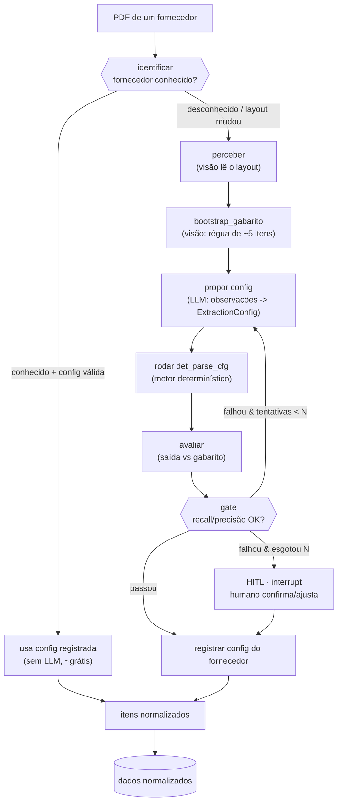
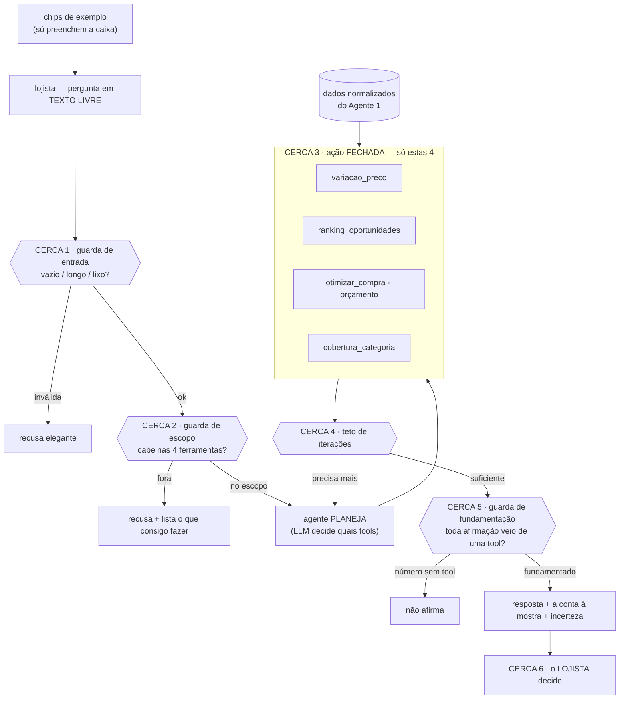

# SmartProcure — Arquitetura dos Agentes

Dois agentes, duas cadências. O Agente 1 **aprende a ler** uma fonte (episódico); o Agente 2 **responde perguntas** sobre os dados (recorrente). O Agente 1 alimenta o Agente 2.

---

## Agente 1 — Onboarding (auto-aprendizado, episódico)

Loop evaluator-optimizer. Aprende a **config de extração** de um fornecedor, registra, e só re-dispara em fornecedor novo ou layout mudado. O ciclo de auto-aprendizado é `propor → rodar → avaliar → corrigir` até um gate.

O **auto-aprendizado** é a aresta `GATE --falhou--> PROP`: o agente lê o próprio erro (gap entre saída do motor e gabarito) e re-propõe a config. Registra ao passar. Uma vez registrada, o `identificar` manda pelo caminho rápido (sem LLM) — mas **valida em 1 página** antes de confiar (se falhar = layout mudou → volta ao loop). Status: motor (`det_parse_cfg`) validado 100% no LEHMOX real.

---

## Agente 2 — Analista (recorrente, com cercas)

Roda a cada pergunta do lojista. **Input aberto, espaço de ação fechado.** 6 cercas; as únicas saídas com número passam obrigatoriamente por uma ferramenta determinística.

As 6 cercas: (1) entrada, (2) escopo, (3) ação fechada às 4 tools, (4) teto de iterações, (5) fundamentação (só afirma o que uma tool calculou), (6) decisão humana. Princípio: **limita-se a AÇÃO, não o INPUT** — o pior caso de qualquer entrada ruim é uma recusa elegante, nunca um número inventado.

---

## A ponte
`dados normalizados` é o contrato entre os dois: o Agente 1 (onboarding) enche; o Agente 2 (analista) consome. Nenhum dos dois é teatro — um aprende fontes novas, o outro entrega valor toda vez.
