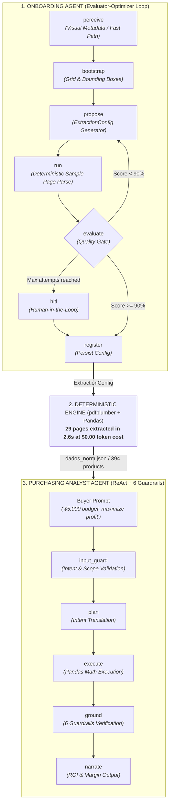

# 🛒 Agentic Catalog Intelligence & Procurement Engine

[](https://www.python.org/)
[](https://langchain-ai.github.io/langgraph/)
[](https://smith.langchain.com/)
[](https://opensource.org/licenses/MIT)

> **Enterprise-grade multi-agent architecture for automated PDF catalog onboarding and deterministic, zero-hallucination purchasing analysis.**

---

*Read this in other languages:* [🇧🇷 **Versão em Português**](README.pt-BR.md)

---

## 🎯 The Business Problem

In retail and wholesale, profit margins depend directly on **buying low and selling high**. However, retail store owners receive weekly 30+ page PDF catalogs with hundreds of products, complex wholesale packaging rules (e.g., minimum case quantities), and changing promotional discounts.

### The Naive GenAI Anti-Pattern vs. Our Architectural Solution
* ❌ **The Naive Approach:** Sending 30+ pages of PDFs directly into multimodal LLMs (like GPT-4o) on every run. This burns dollars in token costs, introduces 3–5 minute latency per catalog, and suffers from mathematical hallucinations and truncated tables.
* ✅ **The SmartProcure Approach:** **"AI where it reasons, Deterministic Code where it calculates."** We use LLM reasoning **only once** on a single sample page to discover catalog layout rules into a lightweight `ExtractionConfig`. Once validated, a local deterministic engine (`pdfplumber` + Pandas) extracts the entire 30-page catalog in **2.6 seconds at $0.00 token cost**.

---

## 🏗️ System Architecture

SmartProcure operates as a **two-agent cooperative ecosystem** orchestrated with **LangGraph**:



---

## 🤖 The Agents

### Agent 1: Supplier Onboarding Agent (`agente/graph_en.py`)
Implements Anthropic's **Evaluator-Optimizer** pattern to calibrate layout extraction rules:
1. **`perceive`**: Inspects sample page visual cues (columns, RGB/CMYK offer tags, quantity labels). Includes a **Fast Path**: for known suppliers (e.g., LEHMOX), it retrieves the verified configuration with **zero LLM calls**.
2. **`bootstrap`**: Identifies baseline bounding boxes and grid geometry.
3. **`propose`**: Synthesizes the candidate `ExtractionConfig` (SKU regex, price regex, column coordinates, promo rules).
4. **`run`**: Executes local deterministic extraction against sample page 5.
5. **`evaluate` (Quality Gate)**: Scores precision and recall against a ground-truth benchmark. If $\text{score} < 90\%$, it loops back to `propose` (up to $N$ attempts) or falls back to Human-in-the-Loop (`hitl`).
6. **`register`**: Persists the validated configuration blueprint for batch processing.

### Agent 2: Purchasing Analyst Agent (`agente/grafo_analista_v3_en.py`)
A procurement intelligence agent backed by **6 deterministic guardrails**:
* 🛡️ **Guardrail 1 — Wholesale Case Multiples:** Automatically enforces box lot sizes (`Units/Box`). Loose units cannot be purchased in wholesale.
* 🛡️ **Guardrail 2 — Hard Budget Ceiling:** Strict budget allocation (e.g., \$5,000 budget $\rightarrow$ \$4,608.90 spent, explicitly displaying \$391.10 preserved in company cash).
* 🛡️ **Guardrail 3 — Zero Math Hallucinations:** Mathematical operations (ROI, margin, revenue) are executed purely by Pandas, never by LLM generation.
* 🛡️ **Guardrail 4 — Grounding Verification:** Validates every calculated product against `dados_norm.json` before rendering output.
* 🛡️ **Guardrail 5 — Historical Trend Comparison:** Joins 2026 catalog items with 2023 historical baselines to highlight real price trends.
* 🛡️ **Guardrail 6 — Conversational Context Memory:** Proactively tracks user markup, supplier scope, and follow-up clarifications.

---

## 📊 Performance & FinOps Metrics

| Metric | Naive LLM Parsing (GPT-4o) | SmartProcure Architecture | Improvement |
|---|---|---|---|
| **Batch Processing Time (29 pages)** | ~180 – 240 seconds | **2.67 seconds** | **~80x faster** |
| **Batch Token Cost** | ~$3.50 – $5.00 / catalog | **$0.00 (Fast Path)** | **100% savings** |
| **Calculation Accuracy** | Probabilistic (~85–92%) | **100% Deterministic** | **Zero drift** |
| **Observability** | None / Blackbox | **Full LangSmith Tracing** | **Audit-ready** |

---

## 📁 Repository Structure

```
.
├── agente/                      # Core Agent Source Code
│   ├── graph_en.py              # Agent 1 (English) — Evaluator-Optimizer
│   ├── graph.py                 # Agent 1 (Portuguese)
│   ├── grafo_analista_v3_en.py  # Agent 2 (English) — Analyst with 6 Guardrails
│   ├── grafo_analista_v3.py     # Agent 2 (Portuguese)
│   ├── engine.py                # Deterministic pdfplumber parsing engine
│   ├── config.py                # Pydantic ExtractionConfig schema
│   ├── tools.py                 # Vision / Mock / Fast Path tools
│   └── dados_norm.json          # Normalized catalog dataset (394 products)
│
├── spike/                       # Experiments, Benchmarks & Studio Integration
│   ├── extrair.py               # Fast CLI batch extractor (2.6s benchmark)
│   ├── studio_graph.py          # Entrypoint exposing graphs for LangGraph Studio
│   ├── langgraph.json           # LangGraph Studio configuration (7 graphs)
│   └── ground_truth_p5_p15.json # Ground truth benchmark dataset
│
├── catalogo/                    # Sample wholesale PDF catalogs
│   ├── LEHMOX 2026.04-completo.pdf
│   └── LEHMOX 2023.01-completo.pdf
│
├── ARQUITETURA.md               # Deep-dive architecture notes (PT-BR)
├── ESCOPO_FLAGSHIP.md           # Engineering scope & POC boundaries
└── README.md                    # Project documentation (English)
```

---

## 🚀 Quickstart

### Prerequisites
* Python 3.11+ or 3.12
* [uv](https://github.com/astral-sh/uv) (recommended) or standard `pip`

### 1. Installation
```bash
# Clone the repository
git clone https://github.com/YOUR_USERNAME/SmartProcure.git
cd SmartProcure

# Install dependencies with uv (or pip)
uv pip install -r spike/requirements.txt
```

### 2. Run Deterministic Extraction Benchmark
```bash
# Extract full 29-page catalog into structured JSON in 2.6 seconds
python spike/extrair.py
```

### 3. Launch LangGraph Studio (Visual Agent IDE)
```bash
# Start LangGraph Studio
langgraph dev --config spike/langgraph.json
```
Open your browser at `http://localhost:2024` and test:
* `graph_onboarding_real_en` (Onboarding Agent)
* `graph_analista_v3_en` (Purchasing Analyst Agent)

---

## 🔍 Observability & Telemetry

Every node execution, prompt template, token count, and state transition is monitored in real-time via **LangSmith**.

```python
# Enable LangSmith in your environment (.env)
LANGCHAIN_TRACING_V2=true
LANGCHAIN_API_KEY=your_langsmith_api_key
LANGCHAIN_PROJECT=SmartProcure
```

---

## 📄 License

This project is licensed under the MIT License — see the [LICENSE](LICENSE) file for details.
