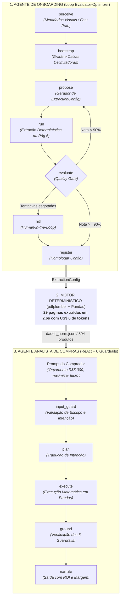

# 🛒 SmartProcure — Inteligência Agêntica de Catálogos & Motor de Compras

[](https://www.python.org/)
[](https://langchain-ai.github.io/langgraph/)
[](https://smith.langchain.com/)
[](https://opensource.org/licenses/MIT)

> **Arquitetura multi-agente de nível empresarial para onboarding automatizado de catálogos PDF e análise determinística de compras sem alucinações matemáticas.**

---

*Disponível em outros idiomas:* [🇺🇸 **English Version**](README.md)

---

## 🎯 O Problema de Negócio

No varejo e atacado, a margem de lucro depende diretamente de **comprar barato para vender bem**. No entanto, lojistas e compradores recebem semanalmente catálogos em PDF de mais de 30 páginas com centenas de produtos, regras de fardo fechado (múltiplos por caixa) e preços promocionais dinâmicos.

### O Anti-Padrão Amador vs. Nossa Solução de Engenharia
* ❌ **A Abordagem Ingênua:** Enviar mais de 30 páginas de PDF diretamente para LLMs multimodais (como GPT-4o) a cada execução. Isso custa vários dólares em tokens por execução, demora de 3 a 5 minutos por catálogo e sofre com alucinações em números e cortes em tabelas.
* ✅ **A Abordagem SmartProcure:** **"IA onde ela raciocina, Código Determinístico onde ele calcula."** Usamos o raciocínio da IA **apenas uma vez** em uma página de teste para descobrir as regras visuais e gerar um `ExtractionConfig`. Uma vez validada a regra, um motor local determinístico (`pdfplumber` + Pandas) processa as 30 páginas em **2,6 segundos com custo US$ 0,00 de tokens**.

---

## 🏗️ Arquitetura do Sistema

O SmartProcure opera como um ecossistema cooperativo de **dois agentes** orquestrados com **LangGraph**:



---

## 🤖 Os Agentes

### Agente 1: Onboarding de Fornecedores (`agente/graph.py` / `agente/graph_en.py`)
Implementa o padrão **Evaluator-Optimizer** da Anthropic para calibrar as regras de extração:
1. **`perceive`**: Inspeciona pistas visuais na página de teste (colunas, tags RGB/CMYK de oferta, rótulo de quantidade). Inclui o **Fast Path**: para fornecedores conhecidos (ex: LEHMOX), recupera a configuração homologada com **zero chamadas de LLM**.
2. **`bootstrap`**: Identifica as caixas delimitadoras e a geometria da grade.
3. **`propose`**: Sintetiza a proposta de `ExtractionConfig` (regex de SKU, regex de preço, coordenadas de colunas e regras de promoção).
4. **`run`**: Executa a extração determinística local na página de teste (página 5).
5. **`evaluate` (Quality Gate)**: Calcula precisão e recall contra o benchmark de gabarito. Se $\text{score} < 90\%$, retorna para `propose` (até $N$ tentativas) ou aciona Human-in-the-Loop (`hitl`).
6. **`register`**: Salva a configuração homologada para processamento em lote.

### Agente 2: Analista de Compras (`agente/grafo_analista_v3.py` / `agente/grafo_analista_v3_en.py`)
Agente de inteligência de compras protegido por **6 guardrails determinísticos**:
* 🛡️ **Guardrail 1 — Múltiplos de Caixa Fechada:** Respeita o lote mínimo por fardo (`Un/Cx`). Não compra frações no atacado.
* 🛡️ **Guardrail 2 — Teto Rígido de Orçamento:** Alocação orçamentária estrita (ex: Orçamento de R$ 5.000,00 $\rightarrow$ Gasto de R$ 4.608,90, explicitando R$ 391,10 preservados no caixa da loja).
* 🛡️ **Guardrail 3 — Zero Alucinações Matemáticas:** Cálculos de ROI, margem e receita são executados exclusivamente pelo Pandas em Python.
* 🛡️ **Guardrail 4 — Grounding e Verificação:** Valida cada produto calculado contra a base `dados_norm.json` antes de responder.
* 🛡️ **Guardrail 5 — Comparativo Histórico de Tendência:** Cruza produtos do catálogo 2026 com a base histórica de 2023 para apontar variações reais de preço.
* 🛡️ **Guardrail 6 — Memória Conversacional Contextual:** Lembra do markup cadastrado pelo usuário e mantém o contexto de follow-up.

---

## 📊 Métricas de Performance & FinOps

| Métrica | Extração Direta via LLM (GPT-4o) | Arquitetura SmartProcure | Ganho |
|---|---|---|---|
| **Tempo de Extração (29 páginas)** | ~180 a 240 segundos | **2,67 segundos** | **~80x mais rápido** |
| **Custo de Tokens por Catálogo** | ~US$ 3,50 a US$ 5,00 | **US$ 0,00 (Fast Path)** | **100% economia** |
| **Precisão Matemática** | Probabilística (~85–92%) | **100% Determinística** | **Zero desvio** |
| **Observabilidade** | Nenhuma / Caixa-preta | **Trace Completo no LangSmith** | **Auditável** |

---

## 📁 Estrutura do Repositório

```
.
├── agente/                      # Código-Fonte Principal dos Agentes
│   ├── graph_en.py              # Agente 1 (Inglês) — Evaluator-Optimizer
│   ├── graph.py                 # Agente 1 (Português)
│   ├── grafo_analista_v3_en.py  # Agente 2 (Inglês) — Analista com 6 Guardrails
│   ├── grafo_analista_v3.py     # Agente 2 (Português)
│   ├── engine.py                # Motor de extração determinística via pdfplumber
│   ├── config.py                # Schema Pydantic do ExtractionConfig
│   ├── tools.py                 # Ferramentas de Visão / Mock / Fast Path
│   └── dados_norm.json          # Dataset normalizado do catálogo (394 produtos)
│
├── spike/                       # Experimentos, Benchmarks & Integração Studio
│   ├── extrair.py               # Extrator em lote CLI (Benchmark de 2.6s)
│   ├── studio_graph.py          # Entrypoint dos grafos para LangGraph Studio
│   ├── langgraph.json           # Configuração do Studio (7 grafos registrados)
│   └── ground_truth_p5_p15.json # Dataset de benchmark (Ground Truth)
│
├── catalogo/                    # Catálogos em PDF de amostra
│   ├── LEHMOX 2026.04-completo.pdf
│   └── LEHMOX 2023.01-completo.pdf
│
├── ARQUITETURA.md               # Detalhamento arquitetural técnico
├── ESCOPO_FLAGSHIP.md           # Escopo de engenharia e limites do POC
└── README.md                    # Documentação em Inglês
```

---

## 🚀 Como Executar

### Pré-requisitos
* Python 3.11+ ou 3.12
* [uv](https://github.com/astral-sh/uv) (recomendado) ou `pip` tradicional

### 1. Instalação
```bash
# Clone o repositório
git clone https://github.com/SEU_USUARIO/SmartProcure.git
cd SmartProcure

# Instale as dependências via uv (ou pip)
uv pip install -r spike/requirements.txt
```

### 2. Rodar o Benchmark de Extração Determinística
```bash
# Extrai as 29 páginas do catálogo para JSON estruturado em 2.6 segundos
python spike/extrair.py
```

### 3. Iniciar o LangGraph Studio (IDE Visual de Agentes)
```bash
# Inicia o servidor local do LangGraph Studio
langgraph dev --config spike/langgraph.json
```
Acesse no navegador em `http://localhost:2024` e teste:
* `graph_onboarding_real_en` (Agente de Onboarding)
* `graph_analista_v3_en` (Agente Analista de Compras)

---

## 🔍 Observabilidade & Telemetria

Todas as transições de nós, latências, contagens de tokens e estados são rastreadas via **LangSmith**.

```python
# Configure no seu .env para ativar o rastreamento
LANGCHAIN_TRACING_V2=true
LANGCHAIN_API_KEY=sua_chave_langsmith
LANGCHAIN_PROJECT=SmartProcure
```

---

## 📄 Licença

Este projeto está sob a licença MIT — consulte o arquivo [LICENSE](LICENSE) para detalhes.
